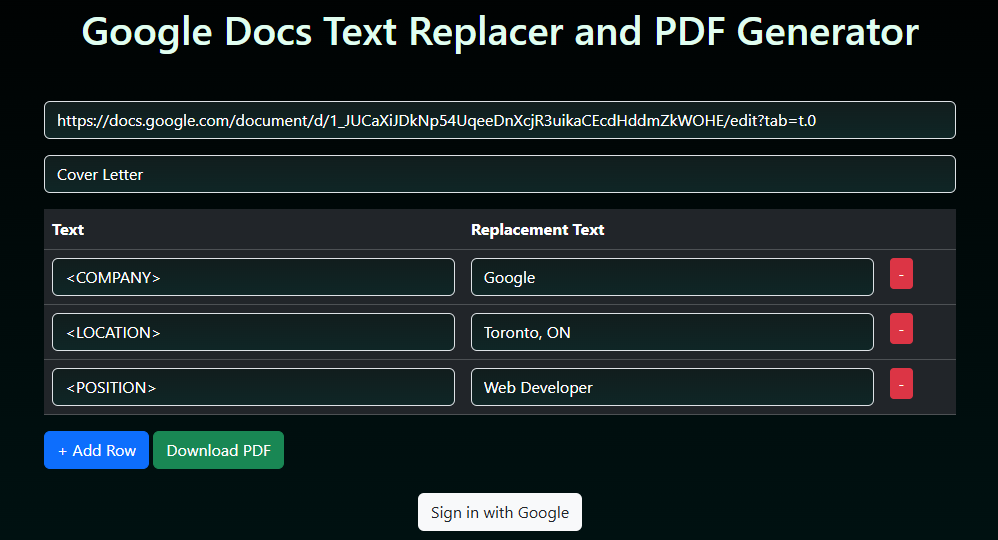

# Google Docs API Text Updater

This project provides a Python utility to update text in a Google Docs document and download it as a PDF. It uses the Google Docs and Google Drive APIs to perform operations such as text replacement, document copying, and PDF export.

You can also try it online (https://leocheng.ca/misc/doc-replace)

## Prerequisites

1. Python 3.7 or higher.
2. Install the required dependencies:
   ```bash
   pip install --upgrade google-api-python-client google-auth-httplib2 google-auth-oauthlib
   ```
3. A `credentials.json` file from the Google Cloud Console with access to the Google Docs and Drive APIs.

## Example Usage

```python
from doc_api import update_and_download_pdf

doc_link = 'https://docs.google.com/document/d/YOUR_GOOGLE_DOC_ID/edit?usp=sharing'
doc_id = 'YOUR_GOOGLE_DOC_ID'

replacements = {
    '<COMPANY>': 'Tech Innovations Inc.',
    '<POSITION>': 'Software Engineer',
    '<LOCATION>': 'New York, NY',
}

# example for cover letters
update_and_download_pdf(doc_id, replacements, f'Cover Letter - Updated')
```

### Parameters for `update_and_download_pdf`

#### Args:

- `doc_id` (str): The ID of the original Google Docs document to be updated.
- `replacements` (dict): A dictionary where keys are text and values are the replacement text.
- `output_name` (str, optional): The name of the output PDF file (without extension).
- `save` (bool, optional): If True, a temporary document will be saved.

#### Returns:

- `None`

## Web Usage and example Screenshots




